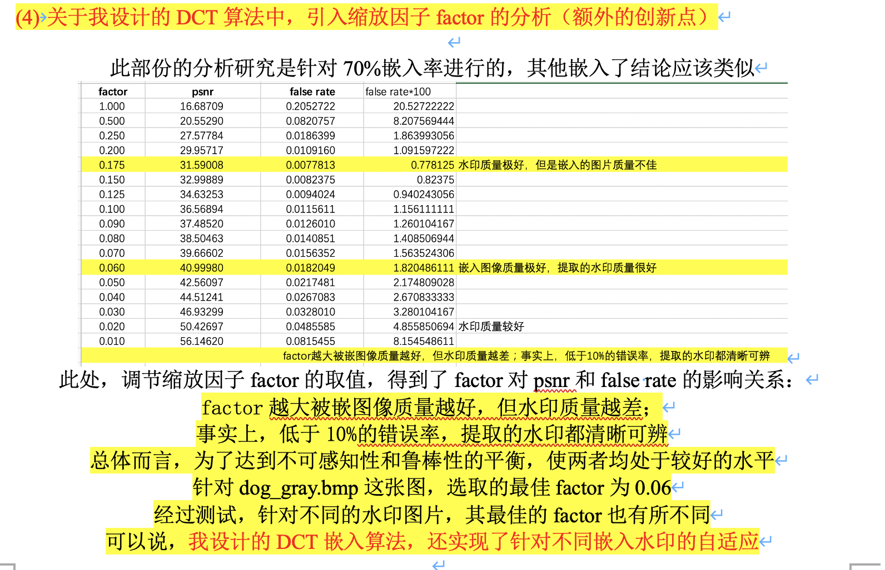
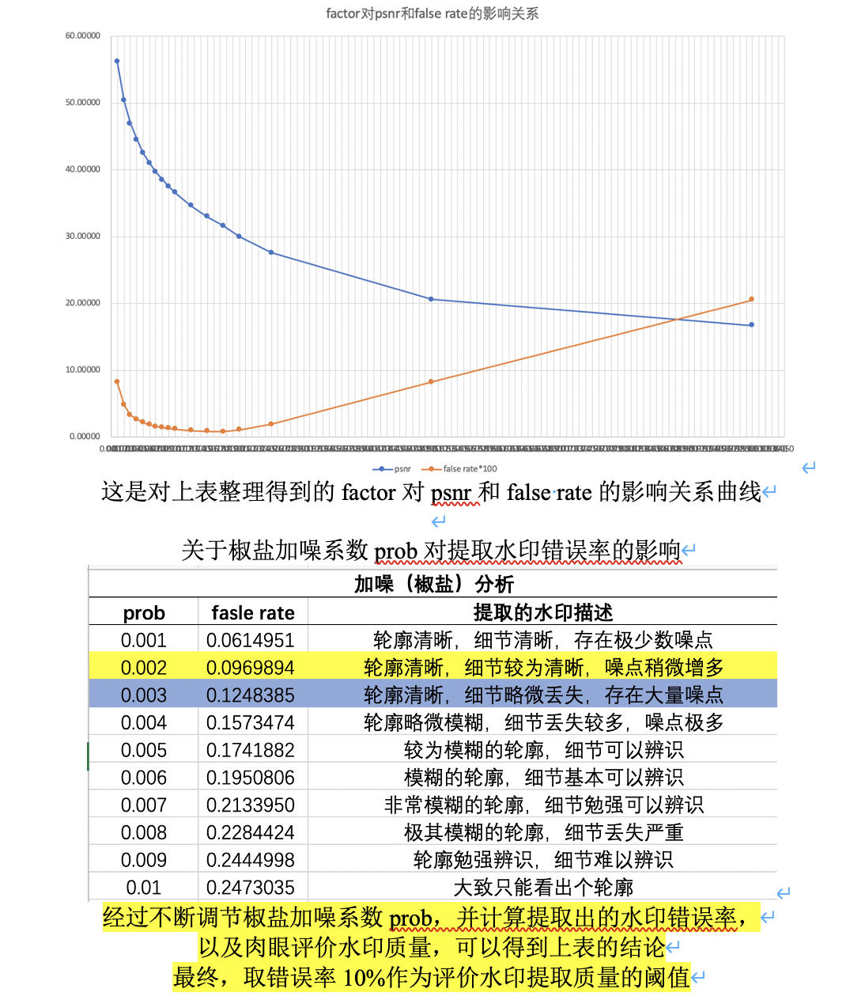

# DCT Steganography Algorithm

### Brief intro

Implementation and Performance Analysis of DCT Steganography Algorithm.  Tests found that it has excellent imperceptibility (PSNR all above 40). When encountering noised images, the error rate of watermark extraction is low, indicating certain robustness. By introducing the scaling factor, the best embedding effect can be obtained for the specific carrier and watermark. 

More details can be found in [DCT_report_draft.pdf](./DCT_report_draft.pdf) . The following are some screenshots of the report draft. Later(maybe), I will sort out the draft and supplement this README.

